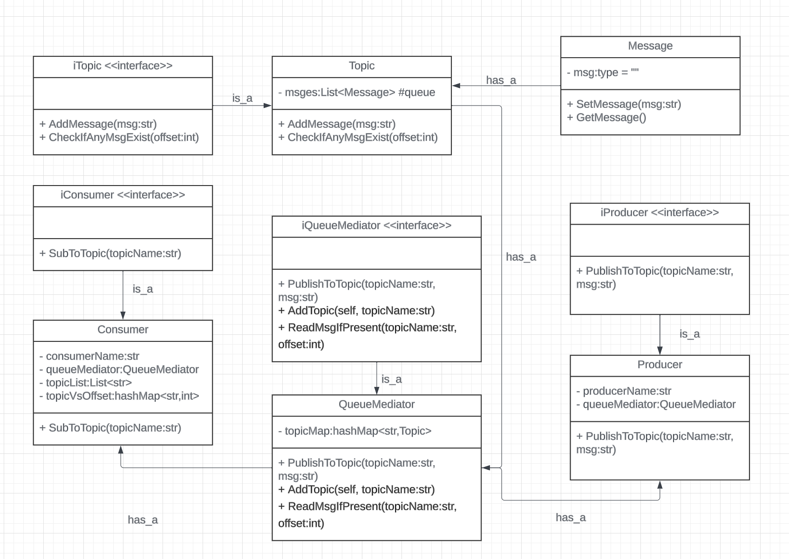

### Docs: 
[notion->link](https://www.notion.so/LLD-Design-Kafka-9b7abe1e99004c3eaf5d8fcd6963b265?pvs=4) (same as readme)

---------
 

# Problem statement:

Design an In-Memory Distributed Queue like Kafka.

## Requirements Gathering:

1. The queue should be in-memory and does not require access to the file system.
2. There can be multiple topics in the queue.
3. A (string) message can be published on a topic by a producer/publisher and consumers/subscribers topic to receive the messages.
4. There can be multiple producers and consumers.
5. A producer can publish to multiple topics.
6. A consumer can listen from multiple topics.
7. The consumer should print "<consumer_id> received <message>" on receiving the message.
8. The queue system should be multithreaded, i.e., messages can be produced or consumed in parallel producers/consumers.

### Possible Use cases

1. User should be able to add topic
2. User should be able to add producers 3. User should be able to add consumers
3. User should be able to publish message
4. System should be able to consume message

### MVP

1. Create Producer
2. Create Consumer
3. Create Topic
4. Publish Message
5. Consume Message

### Not in scope

- Security

## Proposed Solution

### Possible Entities/Classes (OOP/Relational-EER)

Entity (subclasses)Technical naming Domain naming 

- Topic
- Queue
- Message
- Producer (Technical) or Publisher
- Consumer (Technical) or Subscriber

Entity(Composition, properties, etc)

- Queue (List<Topic> topics)
- Message(String msg)
- Consumer (int id)

## Design Principles

1. KISS
2. Separation of concern
3. DRY
4. Code for the maintainer - Modular
5. Minimize coupling and maximize cohesion
6. Composition over inheritance
7. SOLID

## Design Patterns

1. Singleton QueueService, QueueMediator
2. Mediator QueueMediator

## Datastructures and Algorithms

1. Push mechanism only BlockingQueue
2. Push mechanism only Wait Notify Mechanism
3. Multithreading Lock Reentrant lock instead of synchronized block.
4. Push based approach from Topic to Consumer
5. Pull based approach Consumer pulls from the topic preferable and implemented
6. Support for multithreading

## Questions:

1. In memory and distributed?
    
    Not in scope.
    
2. Is there a limit on message size?
    1. 64kb, 1MB → network - POST, GET.
    2. We don't have limits
    3. Kafka 1M event size.
    4. 1K is just enough? 1K, 10x-> 10KB
3. In memory solution. What if the memory is full?
    1. We haven't set any limit?
        1. OOM in the current implementation fail fast.
        2. Can we set a limit on number of messages the system take?
            1. 1M messages I can have in the queue.
            2. Code update will be required for this.
4. TTL to old data?
    1. As of now, it's not there.
    2. We can design it.
5. LLD, Is it low latency or high throughput. Maybe like Active MQ.
    1. very low latency - 10ns
    2. on a single throughput depend on how big your personal computer.
    3. 100K QPS in memory.
6. Class loader for class and static initize.
    
    JVM
    
7. Regarding interface split and join, what is the right leveling?
    1. The right balance of interface split or join
    2. The right balance abstractions (almost useless) vs implementations (too complex)
    3. Vehicle correlated
        1. drive
        2. brake
        3. fillFuel
        4. openDoor
        5. closeDoor
        6. repairable

## Difficulty

8/10

## Score

9/10

### References:
Mediator pattern:
[Concept & Coding-LLD](https://youtu.be/bKM2lFPPmmY?si=dG06lfvctcS_J8aF)

### UML:

[link](https://lucid.app/lucidchart/02aeacfa-73e2-4bc2-a87f-310a6414b53c/edit?viewport_loc=-2673%2C-893%2C3636%2C2004%2C0_0&invitationId=inv_36eabc03-14f7-4693-8b46-62f7d4e192b0)

### Video:
https://youtu.be/l6uKzV7yZzM?si=uGQzKgZeOYiF7MkT
